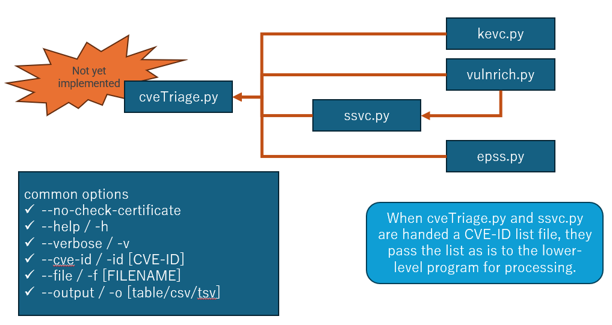

# cveTreage

CVE-ID vulnerability triage programs.

It is aimed at those who have not yet implemented vulnerability management and want to take their skills to the next level, as well as those who have already implemented vulnerability management to improve their skills.

**NOW Beta Preview version**

## Currently implemented programs

- Vulnerability Triage SUPPORT program **(NOT IMPREMENTED YET)**
  - **This is what I originally wanted to do.**
- Vulnerability Triage sub-program
  - epss.py: EPSS value check program.
  - kev.py : Check if a CVE-ID exists in the KEV Catalog.
  - ssvc.py: SSVC outcome determinate program.

## Directory structure

```
./
├── LICENSE
├── README.md
├── decisionTree
│   ├── allAct.csv   (A customized decision tree that turns all outcomes into "ACT".)
│   └── cisa.csv
├── images
│   └── image.png    (Image files used in README.md)
├── lib              (Sub-programs)
│   ├── epss.py
│   ├── kevc.py
│   ├── ssvc.py
│   └── vulnrich.py
└── testdata         (Test CVE-ID file for testing with the "--file" option)
    ├── checkcvelist.txt
    └── testKevCVE.txt
```


## How2use subprograms

The subprogram has two modes.

1. Direct execution
2. Import in python3

ssvc.py uses vulnrich.py, epss.py, and kev.py by importing them.
All programs use the `-h` option to display detailed information.

Basically, using ssvc.py should be enough.


All programs have the following standard options:

- Choose the output format from csv/tsv/table, `-o`
- Pass multiple CVE-IDs in a file, `-f`
- Pass a single CVE-ID, `-id`
- Omit certificate verification in a proxy environment, `--no-check-certificate`

### ssvc.py

This is a program to obtain the SSVC outcome.

- It judges the SSVC Coordinator Tree using the Vulnrichment decision point.
- If the system value "Mission&Well-being" is not specified, all three possible values are displayed.

The main usage is as follows.

- Input the CVE-ID with `-id` or `-file`.
- Once "Mission&Well-being" is decided, pass it with `-m`.
- In a proxy environment, `--no-check-certificate` may be required.
- The output format can be selected as csv/tsv/table with `-o`.
- With -v, CVSS and other data are also displayed.

EXAMPLES:

```
cveTreage/lib$ ./ssvc.py --file ../testdata/testKevCVE.txt --no-check-certificate -o table
+------------------+----------------------+--------------+-------------+-----------------+
| CVE-ID           | Outcome              | Exploitation | Automatable | TechnicalImpact |
+==================+======================+==============+=============+=================+
| CVE-2025-25181   | Attend/Attend/Act    | active       | yes         | partial         |
+------------------+----------------------+--------------+-------------+-----------------+
| CVE-2024-57968   | Track/Attend/Act     | active       | no          | total           |
+------------------+----------------------+--------------+-------------+-----------------+
| CVE-2024-13159   | Attend/Act/Act       | active       | yes         | total           |
+------------------+----------------------+--------------+-------------+-----------------+
| CVE-2024-13160   | Attend/Act/Act       | active       | yes         | total           |
+------------------+----------------------+--------------+-------------+-----------------+
| CVE-2024-13161   | Attend/Act/Act       | active       | yes         | total           |
+------------------+----------------------+--------------+-------------+-----------------+
| CVE-2024-50302   | Track/Attend/Act     | active       | no          | total           |
+------------------+----------------------+--------------+-------------+-----------------+


cveTreage/lib$ ./ssvc.py --file ../testdata/checkcvelist.txt --no-check-certificate -v -o table
+------------------+-----+----------+-------+----------------------+--------------+-------------+-----------------+----------------------------------------------+--------+----------+----------+
| CVE-ID           | KEV | Severity | Score | Outcome              | Exploitation | Automatable | TechnicalImpact | CVSS Vector String                           | Source | EPSS     | EPSS(%)  |
+==================+=====+==========+=======+======================+==============+=============+=================+==============================================+========+==========+==========+
| CVE-2024-48007   | no  | MEDIUM   | 5.3   | Track/Track/Attend   | none         | yes         | partial         | CVSS:3.1/AV:N/AC:L/PR:N/UI:N/S:U/C:L/I:N/A:N | cna    | 0.00058  | 0.15235  |
+------------------+-----+----------+-------+----------------------+--------------+-------------+-----------------+----------------------------------------------+--------+----------+----------+
| CVE-2024-48008   | no  | MEDIUM   | 5.3   | Track/Track/Track    | none         | no          | partial         | CVSS:3.1/AV:L/AC:L/PR:L/UI:N/S:U/C:L/I:L/A:L | cna    | 0.002    | 0.39335  |
+------------------+-----+----------+-------+----------------------+--------------+-------------+-----------------+----------------------------------------------+--------+----------+----------+
| CVE-2024-48010   | no  | MEDIUM   | 6.5   | Track/Track/Track*   | none         | no          | total           | CVSS:3.1/AV:N/AC:L/PR:H/UI:N/S:U/C:N/I:H/A:H | cna    | 0.00081  | 0.21114  |
+------------------+-----+----------+-------+----------------------+--------------+-------------+-----------------+----------------------------------------------+--------+----------+----------+
| CVE-2024-48011   | no  | LOW      | 3.1   | Track/Track/Track    | none         | no          | partial         | CVSS:3.1/AV:N/AC:H/PR:L/UI:N/S:U/C:L/I:N/A:N | cna    | 0.00067  | 0.17876  |
+------------------+-----+----------+-------+----------------------+--------------+-------------+-----------------+----------------------------------------------+--------+----------+----------+
| CVE-2024-48016   | no  | MEDIUM   | 4.6   | Track/Track/Track    | none         | no          | partial         | CVSS:3.1/AV:N/AC:H/PR:L/UI:R/S:U/C:L/I:L/A:L | cna    | 0.00072  | 0.19195  |
+------------------+-----+----------+-------+----------------------+--------------+-------------+-----------------+----------------------------------------------+--------+----------+----------+
```

Usage(ssvc.py -h)

```
usage: ssvc.py [-h] (-id CVE_ID | -f FILE) [-t TREE] [-m {low,medium,high}] [--no-check-certificate] [-v] [-o {csv,tsv,table}] [-sC {CVE-ID,Outcome,Exploitation,Automatable,TechnicalImpact,Severity,Score,EPSS}]
               [-sO {asc,desc}]

Determine SSVC outcomes for given CVE IDs

options:
  -h, --help            show this help message and exit
  -id CVE_ID, --cve_id CVE_ID
                        Specify a single CVE ID.
  -f FILE, --file FILE  Specify a file containing CVE IDs, one per line.
  -t TREE, --tree TREE  Specify the decision tree CSV file.
  -m {low,medium,high}, --mission {low,medium,high}
                        Specify mission & well-being level.
  --no-check-certificate
                        Disable SSL certificate verification.
  -v, --verbose         Display detailed information.
  -o {csv,tsv,table}, --output {csv,tsv,table}
                        Output format.
  -sC {CVE-ID,Outcome,Exploitation,Automatable,TechnicalImpact,Severity,Score,EPSS}, --sort-column {CVE-ID,Outcome,Exploitation,Automatable,TechnicalImpact,Severity,Score,EPSS}
                        Specify the column to sort by.
  -sO {asc,desc}, --sort-order {asc,desc}
                        Specify the sort order (ascending or descending).
...
```

### vulnrich.py

EXAMPLE:

```
cveTreage/lib$ ./vulnrich.py -f ../testdata/testKevCVE.txt -o table
+------------------+---------------+--------------+------------------+
| CVE-ID           | Exploitation  | Automatable  | Technical Impact |
+==================+===============+==============+==================+
| CVE-2025-25181   | active        | yes          | partial          |
+------------------+---------------+--------------+------------------+
| CVE-2024-57968   | active        | no           | total            |
+------------------+---------------+--------------+------------------+
| CVE-2024-13159   | active        | yes          | total            |
+------------------+---------------+--------------+------------------+
| CVE-2024-13160   | active        | yes          | total            |
+------------------+---------------+--------------+------------------+
| CVE-2024-13161   | active        | yes          | total            |
+------------------+---------------+--------------+------------------+
| CVE-2024-50302   | active        | no           | total            |
+------------------+---------------+--------------+------------------+


cveTreage/lib$ ./vulnrich.py -f ../testdata/testKevCVE.txt -o table -v
+------------------+---------------+--------------+------------------+----------+-------+----+----+----+----+----+----+----+----+----------------------------------------------+----------+--------+
| CVE-ID           | Exploitation  | Automatable  | Technical Impact | Severity | Score | AV | AC | PR | UI | S  | C  | I  | A  | Vector                                       | CWE      | Source |
+==================+===============+==============+==================+==========+=======+====+====+====+====+====+====+====+====+==============================================+==========+========+
| CVE-2025-25181   | active        | yes          | partial          | MEDIUM   | 5.8   | N  | L  | N  | N  | C  | L  | N  | N  | CVSS:3.1/AV:N/AC:L/PR:N/UI:N/S:C/C:L/I:N/A:N | CWE-89   | cna    |
+------------------+---------------+--------------+------------------+----------+-------+----+----+----+----+----+----+----+----+----------------------------------------------+----------+--------+
| CVE-2024-57968   | active        | no           | total            | CRITICAL | 9.9   | N  | L  | L  | N  | C  | H  | H  | H  | CVSS:3.1/AV:N/AC:L/PR:L/UI:N/S:C/C:H/I:H/A:H | CWE-434  | cna    |
+------------------+---------------+--------------+------------------+----------+-------+----+----+----+----+----+----+----+----+----------------------------------------------+----------+--------+
| CVE-2024-13159   | active        | yes          | total            | CRITICAL | 9.8   | N  | L  | N  | N  | U  | H  | H  | H  | CVSS:3.1/AV:N/AC:L/PR:N/UI:N/S:U/C:H/I:H/A:H | CWE-36   | cna    |
+------------------+---------------+--------------+------------------+----------+-------+----+----+----+----+----+----+----+----+----------------------------------------------+----------+--------+
| CVE-2024-13160   | active        | yes          | total            | CRITICAL | 9.8   | N  | L  | N  | N  | U  | H  | H  | H  | CVSS:3.1/AV:N/AC:L/PR:N/UI:N/S:U/C:H/I:H/A:H | CWE-36   | cna    |
+------------------+---------------+--------------+------------------+----------+-------+----+----+----+----+----+----+----+----+----------------------------------------------+----------+--------+
| CVE-2024-13161   | active        | yes          | total            | CRITICAL | 9.8   | N  | L  | N  | N  | U  | H  | H  | H  | CVSS:3.1/AV:N/AC:L/PR:N/UI:N/S:U/C:H/I:H/A:H | CWE-36   | cna    |
+------------------+---------------+--------------+------------------+----------+-------+----+----+----+----+----+----+----+----+----------------------------------------------+----------+--------+
| CVE-2024-50302   | active        | no           | total            | HIGH     | 7.8   | L  | L  | L  | N  | U  | H  | H  | H  | CVSS:3.1/AV:L/AC:L/PR:L/UI:N/S:U/C:H/I:H/A:H | CWE-908  | adp    |
+------------------+---------------+--------------+------------------+----------+-------+----+----+----+----+----+----+----+----+----------------------------------------------+----------+--------+
```

Usage(vulnrich.py)

```
usage: vulnrich.py [-h] (-id CVE_ID | -f FILE) [--no-check-certificate] [-v] [-o {csv,tsv,table}]

Fetch decision points from vulnrichment data based on CVE ID

options:
  -h, --help            show this help message and exit
  -id CVE_ID, --cve_id CVE_ID
                        CVE ID in the format CVE-NNNN-NNNN
  -f FILE, --file FILE  Path to a file containing multiple CVE IDs, one per line
  --no-check-certificate
                        Disable SSL certificate verification (only if needed for internal proxies etc.)
  -v, --verbose         Display detailed SSVC data
  -o {csv,tsv,table}, --output {csv,tsv,table}
                        Output format
```


### epss.py

EXAMPLE:

```
cveTreage/lib$ ./epss.py -f ../testdata/testKevCVE.txt -o table
+------------------+---------+---------+------------+
| CVE-ID           | EPSS    | Percent | Date       |
+==================+=========+=========+============+
| CVE-2025-25181   | 0.26874 | 0.95941 | 2025-04-03 |
+------------------+---------+---------+------------+
| CVE-2024-57968   | 0.11034 | 0.92816 | 2025-04-03 |
+------------------+---------+---------+------------+
| CVE-2024-13159   | 0.92486 | 0.99731 | 2025-04-03 |
+------------------+---------+---------+------------+
| CVE-2024-13160   | 0.91864 | 0.99683 | 2025-04-03 |
+------------------+---------+---------+------------+
| CVE-2024-13161   | 0.89481 | 0.99532 | 2025-04-03 |
+------------------+---------+---------+------------+
| CVE-2024-50302   | 0.00232 | 0.43209 | 2025-04-03 |
+------------------+---------+---------+------------+
```

Usage(vulnrich.py)

```
usage: epss.py [-h] (-id CVE_ID | -f FILE) [--no-check-certificate] [-o {csv,tsv,table}]

Fetch EPSS data for given CVE IDs

options:
  -h, --help            show this help message and exit
  -id CVE_ID, --cve_id CVE_ID
                        Specify CVE ID as a comma-separated list
  -f FILE, --file FILE  Specify a file containing CVE IDs
  --no-check-certificate
                        Disable SSL certificate verification
  -o {csv,tsv,table}, --output {csv,tsv,table}
                        Output format
```

### kev.py

EXAMPLE:

```
cveTreage/lib$ ./kevc.py -f ../testdata/testKevCVE.txt -o table
+----------------+------+----------+---------+---------+----------------------+
|CVE-ID          |Exsist|DateAdded |RansomUse|Vendor   |Product               |
+================+======+==========+=========+=========+======================+
|CVE-2025-25181  |yes   |2025-03-10|Unknown  |Advantive|VeraCore              |
|CVE-2024-57968  |yes   |2025-03-10|Unknown  |Advantive|VeraCore              |
|CVE-2024-13159  |yes   |2025-03-10|Unknown  |Ivanti   |Endpoint Manager (EPM)|
|CVE-2024-13160  |yes   |2025-03-10|Unknown  |Ivanti   |Endpoint Manager (EPM)|
|CVE-2024-13161  |yes   |2025-03-10|Unknown  |Ivanti   |Endpoint Manager (EPM)|
|CVE-2024-50302  |yes   |2025-03-04|Unknown  |Linux    |Kernel                |
+----------------+------+----------+---------+---------+----------------------+


cveTreage/lib$ ./kevc.py -f ../testdata/testKevCVE.txt -o table -v
+----------------+------+----------+---------+---------+----------------------+---------+-------------------------------------------------------+
|CVE-ID          |Exsist|DateAdded |RansomUse|Vendor   |Product               |CWEs     |Vulnerability Name                                     |
+================+======+==========+=========+=========+======================+=========+=======================================================+
|CVE-2025-25181  |yes   |2025-03-10|Unknown  |Advantive|VeraCore              |CWE-89   | Advantive VeraCore SQL Injection Vulnerability        |
|CVE-2024-57968  |yes   |2025-03-10|Unknown  |Advantive|VeraCore              |CWE-434  |Advantive VeraCore Unrestricted File Upload Vulnerability|
|CVE-2024-13159  |yes   |2025-03-10|Unknown  |Ivanti   |Endpoint Manager (EPM)|CWE-36   |Ivanti Endpoint Manager (EPM) Absolute Path Traversal Vulnerability|
|CVE-2024-13160  |yes   |2025-03-10|Unknown  |Ivanti   |Endpoint Manager (EPM)|CWE-36   |Ivanti Endpoint Manager (EPM) Absolute Path Traversal Vulnerability|
|CVE-2024-13161  |yes   |2025-03-10|Unknown  |Ivanti   |Endpoint Manager (EPM)|CWE-36   |Ivanti Endpoint Manager (EPM) Absolute Path Traversal Vulnerability|
|CVE-2024-50302  |yes   |2025-03-04|Unknown  |Linux    |Kernel                |CWE-908  |Linux Kernel Use of Uninitialized Resource Vulnerability|
+----------------+------+----------+---------+---------+----------------------+---------+-------------------------------------------------------+
```

Usage(vulnrich.py)

```
usage: kevc.py [-h] (-id CVE_ID | -f FILE) [--no-check-certificate] [-v] [-o {csv,tsv,table}]

Fetch data from CISA's Known Exploited Vulnerability Catalog.

options:
  -h, --help            show this help message and exit
  -id CVE_ID, --cve_id CVE_ID
                        Specify a single CVE ID.
  -f FILE, --file FILE  Specify a file containing CVE IDs, one per line.
  --no-check-certificate
                        Disable SSL certificate verification.
  -v, --verbose         Display detailed information.
  -o {csv,tsv,table}, --out {csv,tsv,table}
                        Output format.
```


# Future




# LICENSE

MIT License.

